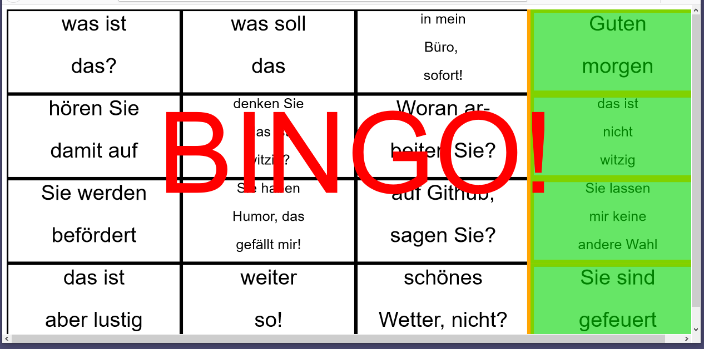

*A very basic bingo game engine.*

# How to Use:

- adjust parameters in user_input.js (most importantly, your items)
- open index.html
- click on the cells with the items that were just announced
- enjoy your bingos! (you can continue clicking after a bingo)

# (Goal) Features:

- input list of words
- set a grid size:
	- quadratic if in three directions (horizontal, vertical, diagonal)
	- non-quadratic --> just allow bingo in smaller direction
	- **as of now only quadratic support**

## TODOs:

- Multiplayer functions:
	- let players log in
	- check if phrase was said by comparing other players' timing of check-offs